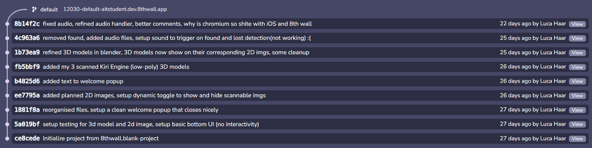

# AR Art Explorer

**AR Art Explorer** is an augmented reality (AR) app that allows you to view beautiful personally scanned 3D models when you view certain paintings.

## Description

A simple AR app that shows hand scanned 3D models that relate to pieces of art around my house.

The project was built using the **8th Wall** AR development platform. Due to workspace access restrictions tied to my university subject, I will no longer be able to make updates or edits once the class concludes.
  
## Demo
Watch the demo video: [YouTube Demo](https://www.youtube.com/watch?v=dA9gEFtdNDc)

## Source Control

The complete source control history for the original development is captured in the image below:  

## Technologies Used

- **8th Wall**: Online AR development platform.
- **Web Technologies**: JavaScript, HTML, and CSS for front-end development.
- **3D Assets**: 3D models are my own chosen objects scanned using Kiri Engine
- **SFX**: Audio sourced from Pixabay

---

This was a fun mini project to learn some of the basics of the 8th wall platform.
